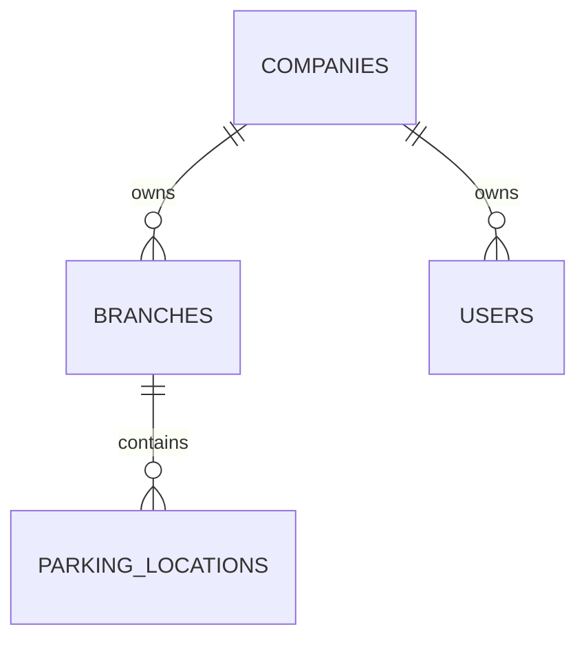

# Company Management Module

Only JWT-authenticated users with `is_super_admin: true` can access the Company Management API and UI. The platform still requires `X-Company-ID` on every versioned request; for a super administrator it establishes request context but does not limit which company record can be managed.

## API contract

Every endpoint is under `/api/v1/companies`, requires `Authorization: Bearer <access-token>` and `X-Company-ID: <ObjectId>`, and appears in Swagger at `/docs`.

| Operation | Endpoint |
| --- | --- |
| List/create companies | `GET`, `POST /companies` |
| Retrieve/update/deactivate a company | `GET`, `PATCH`, `DELETE /companies/{company_id}` |
| List/create branches | `GET`, `POST /companies/{company_id}/branches` |
| Update/deactivate a branch | `PATCH`, `DELETE /companies/{company_id}/branches/{branch_id}` |
| List/create locations | `GET`, `POST /companies/{company_id}/branches/{branch_id}/locations` |
| Update/deactivate a location | `PATCH`, `DELETE /companies/{company_id}/branches/{branch_id}/locations/{location_id}` |

`DELETE` performs a soft deactivation and cascades that inactive state to child branches and locations. It does not erase historical data.

## MongoDB schema and indexes

### `companies`

```json
{
  "company_name": "Acme Logistics Pvt Ltd",
  "code": "ACME_LOGISTICS",
  "logo_url": "https://assets.example.com/acme-logo.svg",
  "address": { "line1": "42 Logistics Road", "city": "Bengaluru", "state": "Karnataka", "postal_code": "560001", "country_code": "IN" },
  "gstin": "29ABCDE1234F1Z5",
  "currency": "INR",
  "theme": { "primary_color": "#0B4F6C", "secondary_color": "#EF8354", "logo_url": "https://assets.example.com/acme-logo.svg" },
  "receipt_footer": "Thank you for parking with Acme.",
  "phone": "+919999999999",
  "email": "operations@acme.example",
  "date_format": "DD/MM/YYYY",
  "time_format": "24h",
  "timezone": "Asia/Kolkata",
  "status": "active"
}
```

- Strict validator requires name, code, currency, status, and audit timestamps.
- Unique index: `{ code: 1 }`.
- Query indexes: `{ company_name: 1 }`, `{ status: 1, company_name: 1 }`.
- GSTIN is validated using the Indian 15-character format; phone uses E.164; currency is an uppercase ISO-4217 code; theme colors require `#RRGGBB`.

### `branches`

```json
{
  "company_id": { "$oid": "..." },
  "name": "Bengaluru North",
  "code": "BLR_NORTH",
  "address": { "line1": "North Gate", "city": "Bengaluru", "state": "Karnataka", "postal_code": "560064", "country_code": "IN" },
  "phone": "+918888888888",
  "email": "blr-north@acme.example",
  "timezone": "Asia/Kolkata",
  "status": "active"
}
```

- Strict validator requires company, name, code, status, and audit timestamps.
- Unique index: `{ company_id: 1, code: 1 }`.
- List index: `{ company_id: 1, status: 1, name: 1 }`.

### `parking_locations`

```json
{
  "company_id": { "$oid": "..." },
  "branch_id": { "$oid": "..." },
  "name": "Heavy Vehicle Yard A",
  "code": "HV_A",
  "address": { "line1": "Gate 3", "city": "Bengaluru", "state": "Karnataka", "postal_code": "560064", "country_code": "IN" },
  "geo": { "type": "Point", "coordinates": [77.5946, 12.9716] },
  "capacity": 120,
  "phone": "+918888888888",
  "status": "active"
}
```

- Strict validator requires company, branch, name, code, status, and audit timestamps.
- Unique index: `{ branch_id: 1, code: 1 }`.
- List index: `{ company_id: 1, branch_id: 1, status: 1 }`.
- Sparse geo index: `{ geo: "2dsphere" }`.

## Relationships and integrity



The service verifies a parent company is active before creating or changing a branch, and verifies both parent company and branch before changing a location. All identifiers are checked as `ObjectId` values and all write operations capture actor/timestamps. Company deactivation cascades status changes to prevent further operational use of child facilities.

## Responsive UI

`/companies` is protected by the frontend `SuperAdminRoute`. Its responsive MUI layout stacks the company selector and detail panel on mobile, shows a two-column management workspace on desktop, and uses dialogs for company, branch, and location create/edit workflows.
