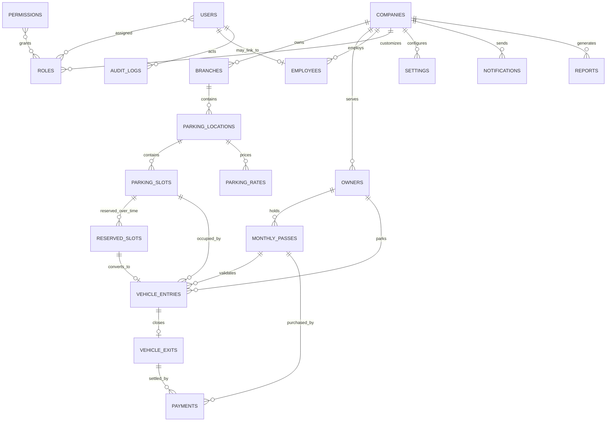

# MongoDB Collection Design

This is the logical schema for the Commercial Vehicle Parking Management System. It is a multi-tenant design: every tenant-owned document carries `company_id`, and every operational document is additionally scoped to `branch_id` and/or `location_id` as appropriate. IDs below are MongoDB `ObjectId` values unless stated otherwise.

## Modelling rules

- Store money as `Decimal128`, never binary floating point. API payloads use decimal strings and are converted by the persistence adapter.
- Store all timestamps as BSON `Date` in UTC. All active records include `created_at`, `updated_at`, `created_by`, and `updated_by` where an actor exists.
- Use references for aggregate roots and high-cardinality data; embed small immutable snapshots needed for historical documents (`vehicle`, `rate_snapshot`, `owner_snapshot`).
- All service/repository queries must include `company_id`. Platform administrators are the sole exception.
- Use MongoDB collection validators with `$jsonSchema`; application Pydantic models enforce richer rules and cross-document checks before writes.
- Use soft deletion only for master data (`status: "inactive"` / `deleted_at`). Financial and audit records are immutable.

### Shared validation fragments

| Field | Rule |
| --- | --- |
| `company_id`, `branch_id`, `location_id` | BSON `objectId`; required where listed. |
| `status` | Explicit enum only; never a free-form string. |
| emails | Lowercase, trimmed, valid email; a unique index enforces identity. |
| phone numbers | E.164 format when populated. |
| registration numbers | Uppercase, trimmed; normalized field is indexed. |
| monetary values | BSON `decimal`, `minimum: 0`. |
| dates | BSON `date`; `valid_to >= valid_from`, `exit_at >= entry_at`. |
| metadata | Object with a documented size limit; do not allow arbitrary top-level fields. |

Each validator should use `validationLevel: "strict"` and `validationAction: "error"`. An abbreviated command is:

```javascript
db.createCollection("parking_slots", {
  validator: { $jsonSchema: { bsonType: "object", required: ["company_id", "location_id", "code", "status"] } },
  validationLevel: "strict",
  validationAction: "error"
});
```

## Collections

### 1. `permissions`

Platform-owned permission catalogue. Do not delete permissions once assigned; deprecate them instead.

| Fields | Validation and indexes |
| --- | --- |
| `_id`, `key`, `name`, `module`, `description`, `status` | `key` matches `^[a-z]+:[a-z_]+$`; `status` is `active` or `deprecated`. Unique `{ key: 1 }`; index `{ module: 1, status: 1 }`. |

```json
{ "key": "parking_entry:save", "name": "Create vehicle entry", "module": "parking_entry", "status": "active" }
```

### 2. `roles`

Role definitions can be platform (`scope: "system"`) or company-specific (`scope: "company"`). `permission_ids` references `permissions`.

| Fields | Validation and indexes |
| --- | --- |
| `_id`, `scope`, `company_id?`, `code`, `name`, `permission_ids`, `is_system`, `status` | `scope` is `system` or `company`; `company_id` required only for company scope; permissions must be a unique ObjectId array. Unique `{ scope: 1, company_id: 1, code: 1 }`; index `{ company_id: 1, status: 1 }`. |

```json
{ "scope": "company", "company_id": { "$oid": "..." }, "code": "branch_manager", "permission_ids": [{ "$oid": "..." }], "status": "active" }
```

### 3. `users`

Authentication identity, separate from employment. A user belongs to exactly one company; an explicitly flagged super administrator may operate across company contexts.

| Fields | Validation and indexes |
| --- | --- |
| `_id`, `company_id`, `email`, `password_hash`, `display_name`, `status`, `role_ids[]`, `is_super_admin`, `last_login_at?`, `mfa?` | `company_id` is required and immutable after creation; `status` is `invited`, `active`, `locked`, or `disabled`; `password_hash` is never returned by the API; `is_super_admin` is provisioned only by a platform bootstrap process. Unique `{ email: 1 }`; index `{ company_id: 1, status: 1 }`. |

```json
{ "company_id": { "$oid": "..." }, "email": "ops@example.com", "password_hash": "<argon2id-hash>", "display_name": "Asha Rao", "role_ids": [{ "$oid": "..." }], "is_super_admin": false, "status": "active" }
```

### 4. `companies`

Tenant root and legal/billing identity.

| Fields | Validation and indexes |
| --- | --- |
| `_id`, `code`, `legal_name`, `display_name`, `tax_id?`, `contact`, `address`, `timezone`, `currency`, `status` | `code` is uppercase slug; `contact.email` is normalized; ISO currency and IANA timezone required. Unique `{ code: 1 }`; unique sparse `{ tax_id: 1 }`; index `{ status: 1, display_name: 1 }`. |

```json
{ "code": "ACME_LOGISTICS", "legal_name": "Acme Logistics Pvt Ltd", "display_name": "Acme Logistics", "timezone": "Asia/Kolkata", "currency": "INR", "status": "active" }
```

### 5. `branches`

Operational branch under a company. Address is embedded because it is bounded, read with the branch, and changes rarely.

| Fields | Validation and indexes |
| --- | --- |
| `_id`, `company_id`, `code`, `name`, `address`, `timezone`, `contact`, `status` | `company_id` required; `code` unique within a company; valid IANA timezone. Unique `{ company_id: 1, code: 1 }`; index `{ company_id: 1, status: 1 }`. |

```json
{ "company_id": { "$oid": "..." }, "code": "BLR-01", "name": "Bengaluru North", "timezone": "Asia/Kolkata", "status": "active" }
```

### 6. `employees`

Company workforce record. `user_id` is optional to support employees who do not receive a login.

| Fields | Validation and indexes |
| --- | --- |
| `_id`, `company_id`, `branch_id`, `user_id?`, `employee_code`, `name`, `phone?`, `designation`, `employment_status`, `joined_at` | `employment_status` is `active`, `on_leave`, or `inactive`; one user may map to at most one active employee per company. Unique `{ company_id: 1, employee_code: 1 }`; unique sparse `{ company_id: 1, user_id: 1 }`; index `{ company_id: 1, branch_id: 1, employment_status: 1 }`. |

```json
{ "company_id": { "$oid": "..." }, "branch_id": { "$oid": "..." }, "employee_code": "EMP-0042", "name": "Mohan Singh", "designation": "Attendant", "employment_status": "active" }
```

### 7. `owners`

Customer or fleet owner. This accommodates individual drivers, fleet companies, and transport agents.

| Fields | Validation and indexes |
| --- | --- |
| `_id`, `company_id`, `owner_code`, `type`, `name`, `contact`, `tax_id?`, `addresses[]`, `status` | `type` is `individual`, `business`, or `agent`; at least one contact method; soft-delete only. Unique `{ company_id: 1, owner_code: 1 }`; index `{ company_id: 1, "contact.phone": 1 }`; sparse index `{ company_id: 1, tax_id: 1 }`. |

```json
{ "company_id": { "$oid": "..." }, "owner_code": "OWN-102", "type": "business", "name": "Roadline Transport", "contact": { "phone": "+919999999999" }, "status": "active" }
```

### 8. `parking_locations`

A physical parking facility within a branch. GeoJSON enables nearest-location and map searches.

| Fields | Validation and indexes |
| --- | --- |
| `_id`, `company_id`, `branch_id`, `code`, `name`, `address`, `geo`, `operating_hours`, `capacity`, `status` | `geo` is GeoJSON `Point` with longitude/latitude; capacity values are non-negative integers. Unique `{ company_id: 1, code: 1 }`; index `{ company_id: 1, branch_id: 1, status: 1 }`; `2dsphere` `{ geo: "2dsphere" }`. |

```json
{ "company_id": { "$oid": "..." }, "branch_id": { "$oid": "..." }, "code": "BLR-NORTH-YARD", "name": "North Yard", "geo": { "type": "Point", "coordinates": [77.5946, 12.9716] }, "capacity": { "total": 120, "heavy": 60 }, "status": "active" }
```

### 9. `parking_slots`

Individually addressable bay/slot. Slot availability is authoritative here; active entry writes and slot state changes must occur in one MongoDB transaction.

| Fields | Validation and indexes |
| --- | --- |
| `_id`, `company_id`, `branch_id`, `location_id`, `zone?`, `code`, `category`, `dimensions?`, `features[]`, `status`, `current_entry_id?` | `category` is `two_wheeler`, `car`, `light_commercial`, `heavy_commercial`, or `oversize`; `status` is `available`, `occupied`, `reserved`, `maintenance`, or `inactive`. Unique `{ location_id: 1, code: 1 }`; index `{ company_id: 1, location_id: 1, category: 1, status: 1 }`; sparse `{ current_entry_id: 1 }`. |

```json
{ "company_id": { "$oid": "..." }, "branch_id": { "$oid": "..." }, "location_id": { "$oid": "..." }, "zone": "H1", "code": "H1-034", "category": "heavy_commercial", "features": ["covered"], "status": "available" }
```

### 10. `parking_rates`

Versioned tariff rules. Never modify a rate used by an entry; close its effective interval and create a new version.

| Fields | Validation and indexes |
| --- | --- |
| `_id`, `company_id`, `branch_id?`, `location_id?`, `name`, `vehicle_category`, `billing_unit`, `rate`, `minimum_charge?`, `grace_minutes`, `effective_from`, `effective_to?`, `priority`, `status` | `billing_unit` is `hour`, `day`, `visit`, or `month`; `rate`/minimum are decimal >= 0; valid effective range. Index `{ company_id: 1, location_id: 1, vehicle_category: 1, status: 1, effective_from: -1 }`; index `{ company_id: 1, branch_id: 1, effective_from: -1 }`. |

```json
{ "company_id": { "$oid": "..." }, "location_id": { "$oid": "..." }, "name": "Heavy hourly 2026", "vehicle_category": "heavy_commercial", "billing_unit": "hour", "rate": { "$numberDecimal": "150.00" }, "grace_minutes": 15, "effective_from": { "$date": "2026-01-01T00:00:00Z" }, "status": "active" }
```

### 11. `monthly_passes`

Prepaid entitlement for one vehicle/owner at one location or branch.

| Fields | Validation and indexes |
| --- | --- |
| `_id`, `company_id`, `branch_id?`, `location_id?`, `pass_number`, `owner_id`, `vehicle`, `valid_from`, `valid_to`, `amount`, `status`, `payment_id?` | `status` is `draft`, `active`, `expired`, `suspended`, or `cancelled`; vehicle has normalized registration number; valid date interval. Unique `{ company_id: 1, pass_number: 1 }`; index `{ company_id: 1, "vehicle.registration_number_normalized": 1, status: 1 }`; index `{ company_id: 1, valid_to: 1, status: 1 }`. |

```json
{ "company_id": { "$oid": "..." }, "location_id": { "$oid": "..." }, "pass_number": "MP-2026-00071", "owner_id": { "$oid": "..." }, "vehicle": { "registration_number": "KA01AB1234", "registration_number_normalized": "KA01AB1234", "category": "heavy_commercial" }, "valid_from": { "$date": "2026-07-01T00:00:00Z" }, "valid_to": { "$date": "2026-07-31T23:59:59Z" }, "status": "active" }
```

### 12. `reserved_slots`

Time-bound reservation of a specific slot. A reservation is not an occupancy record.

| Fields | Validation and indexes |
| --- | --- |
| `_id`, `company_id`, `branch_id`, `location_id`, `slot_id`, `owner_id?`, `vehicle?`, `starts_at`, `ends_at`, `status`, `entry_id?` | `status` is `pending`, `confirmed`, `checked_in`, `expired`, `cancelled`, or `no_show`; interval must be positive. Index `{ company_id: 1, location_id: 1, slot_id: 1, starts_at: 1, ends_at: 1 }`; index `{ company_id: 1, owner_id: 1, starts_at: -1 }`; TTL `{ expires_at: 1 }` only for transient unconfirmed reservations. Overlap is prevented by a transactional service check. |

```json
{ "company_id": { "$oid": "..." }, "branch_id": { "$oid": "..." }, "location_id": { "$oid": "..." }, "slot_id": { "$oid": "..." }, "owner_id": { "$oid": "..." }, "starts_at": { "$date": "2026-07-26T08:00:00Z" }, "ends_at": { "$date": "2026-07-26T18:00:00Z" }, "status": "confirmed" }
```

### 13. `vehicle_entries`

Immutable check-in event plus the current parking session state. This is the high-write collection.

| Fields | Validation and indexes |
| --- | --- |
| `_id`, `company_id`, `branch_id`, `location_id`, `ticket_number`, `owner_id?`, `vehicle`, `driver?`, `slot_id?`, `reservation_id?`, `monthly_pass_id?`, `entry_at`, `entry_by`, `status`, `rate_snapshot?` | `status` is `open`, `closed`, `cancelled`, or `void`; `entry_at` required; vehicle snapshot includes normalized registration and category. Unique `{ company_id: 1, ticket_number: 1 }`; partial unique `{ company_id: 1, "vehicle.registration_number_normalized": 1 }` where `{ status: "open" }`; index `{ company_id: 1, location_id: 1, status: 1, entry_at: -1 }`; index `{ company_id: 1, owner_id: 1, entry_at: -1 }`. |

```json
{ "company_id": { "$oid": "..." }, "branch_id": { "$oid": "..." }, "location_id": { "$oid": "..." }, "ticket_number": "BLR-20260726-00031", "owner_id": { "$oid": "..." }, "vehicle": { "registration_number": "KA01AB1234", "registration_number_normalized": "KA01AB1234", "category": "heavy_commercial" }, "slot_id": { "$oid": "..." }, "entry_at": { "$date": "2026-07-26T08:12:00Z" }, "entry_by": { "$oid": "..." }, "status": "open" }
```

### 14. `vehicle_exits`

One immutable checkout/settlement record for each completed entry. The unique index on `entry_id` ensures a single exit.

| Fields | Validation and indexes |
| --- | --- |
| `_id`, `company_id`, `branch_id`, `location_id`, `entry_id`, `ticket_number`, `exit_at`, `exit_by`, `duration_minutes`, `charge_breakdown`, `total_amount`, `payment_status`, `status` | `status` is `completed`, `waived`, or `void`; totals are decimal >= 0; `entry_id` must be a valid referenced entry in `open` state before transaction commit. Unique `{ entry_id: 1 }`; unique `{ company_id: 1, ticket_number: 1 }`; index `{ company_id: 1, location_id: 1, exit_at: -1 }`; index `{ company_id: 1, payment_status: 1, exit_at: -1 }`. |

```json
{ "company_id": { "$oid": "..." }, "branch_id": { "$oid": "..." }, "location_id": { "$oid": "..." }, "entry_id": { "$oid": "..." }, "ticket_number": "BLR-20260726-00031", "exit_at": { "$date": "2026-07-26T12:25:00Z" }, "duration_minutes": 253, "total_amount": { "$numberDecimal": "600.00" }, "payment_status": "paid", "status": "completed" }
```

### 15. `payments`

Append-only financial transaction. A payment may settle an exit, monthly pass, reservation deposit, or a future invoice.

| Fields | Validation and indexes |
| --- | --- |
| `_id`, `company_id`, `branch_id?`, `owner_id?`, `reference_type`, `reference_id`, `amount`, `currency`, `method`, `provider`, `provider_transaction_id?`, `idempotency_key`, `status`, `paid_at?`, `failure_reason?` | `reference_type` is `vehicle_exit`, `monthly_pass`, `reservation`, or `invoice`; `method` is `cash`, `card`, `upi`, `bank_transfer`, or `gateway`; status is `initiated`, `authorized`, `paid`, `failed`, `refunded`, or `void`. Unique `{ company_id: 1, idempotency_key: 1 }`; unique sparse `{ provider: 1, provider_transaction_id: 1 }`; index `{ company_id: 1, reference_type: 1, reference_id: 1 }`; index `{ company_id: 1, status: 1, created_at: -1 }`. |

```json
{ "company_id": { "$oid": "..." }, "reference_type": "vehicle_exit", "reference_id": { "$oid": "..." }, "amount": { "$numberDecimal": "600.00" }, "currency": "INR", "method": "upi", "provider": "razorpay", "idempotency_key": "e8b5...", "status": "paid", "paid_at": { "$date": "2026-07-26T12:26:00Z" } }
```

### 16. `notifications`

Durable outbound notification queue and delivery history. Content is rendered before enqueueing, avoiding template drift in audit history.

| Fields | Validation and indexes |
| --- | --- |
| `_id`, `company_id`, `recipient`, `channel`, `template_key?`, `payload`, `reference_type?`, `reference_id?`, `scheduled_at`, `sent_at?`, `status`, `attempts`, `provider_message_id?` | `channel` is `email`, `sms`, `push`, or `in_app`; status is `queued`, `processing`, `sent`, `failed`, or `cancelled`; maximum attempt count is configured. Index `{ status: 1, scheduled_at: 1 }`; index `{ company_id: 1, reference_type: 1, reference_id: 1 }`; sparse `{ provider_message_id: 1 }`; optional TTL `{ expires_at: 1 }` for non-audit notification payloads. |

```json
{ "company_id": { "$oid": "..." }, "recipient": { "owner_id": { "$oid": "..." }, "phone": "+919999999999" }, "channel": "sms", "template_key": "vehicle_exit_receipt", "reference_type": "vehicle_exit", "reference_id": { "$oid": "..." }, "scheduled_at": { "$date": "2026-07-26T12:26:00Z" }, "status": "queued", "attempts": 0 }
```

### 17. `settings`

Scoped configuration with the most specific scope winning: location → branch → company → system.

| Fields | Validation and indexes |
| --- | --- |
| `_id`, `scope`, `company_id?`, `branch_id?`, `location_id?`, `key`, `value`, `value_type`, `is_secret`, `status` | `scope` is `system`, `company`, `branch`, or `location`; parent IDs are required according to scope; `value_type` is `string`, `number`, `boolean`, `json`, or `secret_ref`. Never store secret plaintext; use a vault reference. Unique `{ scope: 1, company_id: 1, branch_id: 1, location_id: 1, key: 1 }`; index `{ company_id: 1, key: 1, status: 1 }`. |

```json
{ "scope": "location", "company_id": { "$oid": "..." }, "branch_id": { "$oid": "..." }, "location_id": { "$oid": "..." }, "key": "grace_period_minutes", "value": 15, "value_type": "number", "is_secret": false, "status": "active" }
```

### 18. `audit_logs`

Immutable, append-only record of security and business-relevant mutations. Before/after values are redacted by an audit serializer.

| Fields | Validation and indexes |
| --- | --- |
| `_id`, `company_id?`, `actor`, `action`, `entity_type`, `entity_id?`, `occurred_at`, `request_id`, `ip?`, `before?`, `after?`, `metadata?` | `action` follows `module:verb`; actor has type `user`, `system`, or `integration`; sensitive fields are excluded. Index `{ company_id: 1, occurred_at: -1 }`; index `{ company_id: 1, entity_type: 1, entity_id: 1, occurred_at: -1 }`; index `{ request_id: 1 }`; index `{ "actor.user_id": 1, occurred_at: -1 }`. |

```json
{ "company_id": { "$oid": "..." }, "actor": { "type": "user", "user_id": { "$oid": "..." } }, "action": "parking:entry_create", "entity_type": "vehicle_entry", "entity_id": { "$oid": "..." }, "occurred_at": { "$date": "2026-07-26T08:12:00Z" }, "request_id": "b2db..." }
```

### 19. `reports`

Report generation request and immutable output metadata, not the analytical source of truth.

| Fields | Validation and indexes |
| --- | --- |
| `_id`, `company_id`, `requested_by`, `type`, `filters`, `format`, `status`, `storage`, `generated_at?`, `expires_at?`, `error?` | `type` is a registered report key; `format` is `csv`, `xlsx`, or `pdf`; `status` is `queued`, `running`, `completed`, `failed`, or `expired`; storage holds object-store key and checksum, never a large binary. Index `{ company_id: 1, type: 1, created_at: -1 }`; index `{ company_id: 1, requested_by: 1, created_at: -1 }`; TTL `{ expires_at: 1 }` for generated artifacts. |

```json
{ "company_id": { "$oid": "..." }, "requested_by": { "$oid": "..." }, "type": "daily_revenue", "filters": { "location_id": "...", "from": "2026-07-26", "to": "2026-07-26" }, "format": "xlsx", "status": "queued" }
```

## Relationship map



The diagram shows logical references, not database joins. Read models should fetch only the required references, or use an aggregation pipeline for reporting screens. Do not use `$lookup` on hot check-in/check-out paths.

## Transaction boundaries and integrity

MongoDB cannot enforce foreign keys. Application services must verify referenced documents belong to the same `company_id` and are active. Use a MongoDB transaction for these operations:

1. Check-in: validate reservation/pass, atomically set slot `occupied`, create `vehicle_entries`, and record audit log.
2. Check-out: create `vehicle_exits`, create/confirm payment, set entry `closed`, release slot, and record audit log.
3. Reservation confirmation/cancellation: check overlap and update slot availability projection where one is maintained.
4. Pass sale/refund: update pass state and append payment/audit records.

Optimistic concurrency should use an integer `version` on mutable operational records (`parking_slots`, `reserved_slots`, `monthly_passes`, settings) to prevent lost updates. Immutable financial and audit records must never be updated after a correction; write a compensating record instead.

## Future scalability

- **Shard deliberately:** begin with replica-set transactions. When volume warrants sharding, use a hashed `company_id` shard key for tenant-local operational collections; assess locality needs before sharding `vehicle_entries` and `payments`.
- **Archive by retention:** move closed entries, exits, notifications, and audit logs to cold storage or an archive database based on company retention policy. Keep reporting aggregates separately.
- **Build read models:** materialize daily occupancy and revenue summaries from change streams or an outbox worker instead of repeatedly aggregating years of transactional data.
- **Partition large indexes:** include `company_id` as the leading key for tenant queries, retain only indexes proven by query telemetry, and use partial indexes for active/open states.
- **Separate blobs:** put photos, scanned documents, and generated reports in object storage; retain only immutable metadata and checksums in MongoDB.
- **Event/outbox evolution:** introduce `outbox_events` when integrations need at-least-once publication. Process notifications, report generation, and webhooks asynchronously with idempotency keys.
- **Privacy/security:** encrypt sensitive PII fields with application or client-side field-level encryption, redact audit copies, and enforce per-company backup/retention policies.
